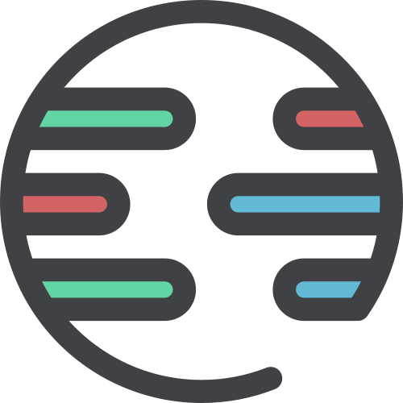

<div align="center">
  <h1>Unitest</h1>



Deno-first **uni**versal **unit** testing framework


[](https://deno.land/x/unitest)
[](https://github.com/denoland/deno)
[](https://doc.deno.land/https/deno.land/x/unitest/mod.ts)

[](https://github.com/TomokiMiyauci/unitest/actions/workflows/test.yaml)
[](https://codecov.io/gh/TomokiMiyauci/unitest)
[](https://deepscan.io/dashboard#view=project&tid=10684&pid=19438&bid=504638)


</div>

---

:construction: This is beta

## Features

- 🦕 Deno-first\
  It has been designed with Deno first, and actively uses the Deno Runtime API.

- 🌎 Universal\
  It is also compatible to work in browsers and Node.js environments. Use the
  compatible `compat` module instead of the Deno Runtime API.

- 🃏 Like jest but not jest\
  You can express declarative tests around the symbolic expect in jest. Also,
  all matchers are composable and customizable. jest and jest-extended matchers
  are provided as presets.

- ♻️ Compositable\
  Unitest is also intended to be used in a browser.\
  For this reason, we provide a composable interface to keep the bundle size as
  small as possible.

- 📄 TypeScript-first\
  Type-safe tests can be expressed. A type filter restricts the availability of
  only those matchers that satisfy the data type under test.\
  It also keeps the bundle size small by transferring part of the data type
  validation to TypeScript.

- 🐺 Isolated\
  Each module is independent, with no dependency on context. This means that
  they can be combined with any module.

## Getting Started

Visit <https://unitest.vercel.app/> to get started with Unitest.

## Quick view

```ts
import { expect, test } from "https://deno.land/x/unitest@$VERSION/mod.ts";

test({
  name: "should not equal",
  fn: () => {
    expect("Deno").not.toBe("Node");
  },
});
```

then, `deno test`

**Currently the test runner CLI relies on the Deno CLI. This is subject to
change in the future.**

## Contributing

Please see our [CONTRIBUTING.md](./CONTRIBUTING.MD).

## License

Copyright © 2021-present [TomokiMiyauci](https://github.com/TomokiMiyauci).

Released under the [MIT](./LICENSE) license
